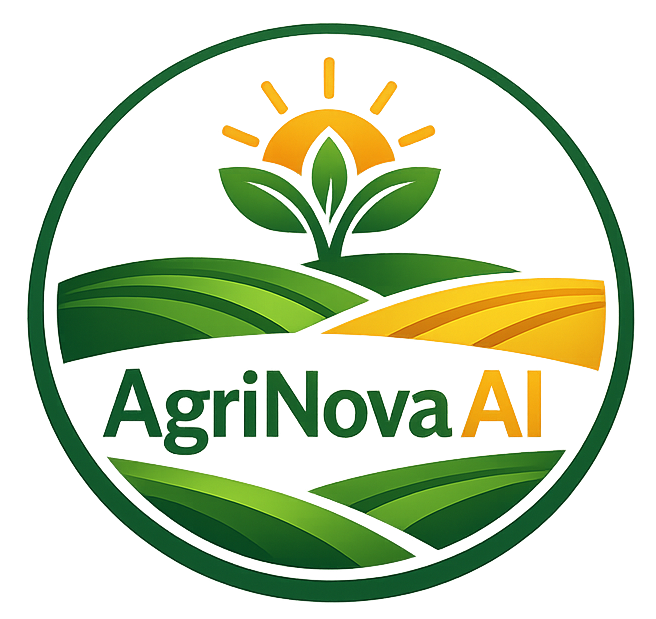

<p align="center">
  
</p>

<h1 align="center">🌾 AgriNovaAI</h1>

<p align="center">
  <strong>Agentic AI-Powered Agricultural Knowledge and Decision Support System</strong>
</p>

<p align="center">
  Combining Large Language Models (LLMs), Retrieval-Augmented Generation (RAG),
  specialized AI agents, external tools and conversational memory to provide
  reliable, explainable and context-aware agricultural assistance.
</p>

<p align="center">
  <em>"AI-powered Agricultural Knowledge Assistant."</em>
</p>

---

## 📌 Project Overview

**AgriNovaAI** is an Agentic AI-powered agricultural assistant designed to help farmers obtain reliable, understandable and context-aware information for everyday farming decisions.

The system combines:

* **Large Language Models (LLMs)** for natural-language understanding and reasoning
* **Retrieval-Augmented Generation (RAG)** for retrieving information from trusted agricultural knowledge sources
* **Specialized AI Agents** for handling different agricultural tasks
* **External Tools and APIs** for real-time information such as weather
* **Vector Embeddings and Semantic Search** for efficient knowledge retrieval
* **Conversation Memory** so farmers do not need to repeatedly provide the same information
* **Explainable AI responses** containing reasoning, supporting information and references
* **Web-based user interfaces** for simple interaction with the agricultural assistant

The initial implementation of AgriNovaAI focuses on **Rice and Coconut crops**. The architecture is intentionally designed to be extensible so that additional crops can be incorporated in future development.

---

# 🎯 Vision

The long-term vision of AgriNovaAI is to develop an intelligent agricultural decision-support platform capable of connecting farmers with trusted agricultural knowledge through an accessible AI interface.

The system aims to transform:

```text
Complex Agricultural Information
            ↓
       AI Processing
            ↓
Context-Aware Recommendation
            ↓
   Explainable Guidance
```

Rather than simply generating an answer, AgriNovaAI is designed to determine **what information is required, which knowledge or tools should be used and how the available information should be combined before producing a response**.

---

# 🌱 Initial Crop Scope

AgriNovaAI is initially being developed with a focused agricultural domain.

### Currently Supported Crops

| Crop       | Initial Support |
| ---------- | --------------- |
| 🌾 Rice    | ✅ Supported     |
| 🥥 Coconut | ✅ Supported     |

The initial implementation focuses on building a reliable system for these crops before expanding the knowledge base and agent capabilities to additional crops.

### Planned Expansion

The architecture can later be extended to support crops such as:

* Vegetables
* Fruits
* Maize
* Tea
* Rubber
* Other economically important crops

The objective is to make crop expansion primarily a **knowledge and configuration task**, rather than requiring a complete redesign of the AI architecture.

---

# 🎯 Problem Statement

Farmers regularly face agricultural problems that require timely and reliable information.

Examples include:

* Crop disease identification
* Pest management
* Fertilizer selection
* Fertilizer application guidance
* Irrigation planning
* Weather-related farming decisions
* Soil-related problems
* Crop cultivation practices
* Crop growth-stage management
* Harvest-related decisions
* Government agricultural information
* Access to reliable agricultural documentation
* Understanding technical agricultural recommendations

A major challenge is that agricultural information is often distributed across:

```text
Government Publications
        ↓
Research Papers
        ↓
Agricultural Manuals
        ↓
University Publications
        ↓
PDF Documents
        ↓
Web Resources
        ↓
Weather Information
        ↓
Market Information
```

Finding the correct information and interpreting it correctly can be difficult for farmers.

A conventional chatbot may also generate an answer from its pretrained knowledge without having access to the latest or domain-specific agricultural information.

AgriNovaAI addresses this problem by combining **trusted knowledge retrieval, specialized agents, external tools and LLM reasoning**.

---

# 💡 Proposed Solution

AgriNovaAI provides a unified agricultural AI assistant capable of:

1. Understanding a farmer's question.
2. Identifying the underlying agricultural problem.
3. Determining what information is required.
4. Selecting appropriate AI agents and tools.
5. Retrieving relevant agricultural knowledge.
6. Using external information sources when required.
7. Combining information from multiple sources.
8. Reasoning over the retrieved information.
9. Generating a clear recommendation.
10. Providing supporting evidence and references.

The high-level concept is:

```text
Farmer
   ↓
Question / Request
   ↓
AgriNovaAI
   ↓
Understand the Problem
   ↓
Plan the Required Actions
   ↓
Select Agents / Tools
   ↓
Retrieve Trusted Knowledge
   ↓
Reason Over Information
   ↓
Generate Recommendation
   ↓
Explain the Recommendation
   ↓
Farmer
```

---

# 🤖 Why Agentic AI?

A traditional chatbot generally follows a simple pattern:

```text
User Question
      ↓
LLM
      ↓
Answer
```

This approach can be insufficient for complex agricultural questions because different questions may require different information sources and different types of reasoning.

AgriNovaAI follows an agentic architecture:

```text
Farmer Question
      ↓
Planner Agent
      ↓
Determine Required Information
      ↓
Select Specialized Agents
      ↓
Use Tools / RAG / APIs
      ↓
Combine Results
      ↓
LLM Reasoning
      ↓
Explainable Recommendation
```

This allows different components of the system to have specialized responsibilities.

---

# 🧠 Core AI Architecture

The core AgriNovaAI architecture consists of several major components:

```text
                    ┌─────────────────────┐
                    │       Farmer        │
                    └──────────┬──────────┘
                               │
                               ▼
                    ┌─────────────────────┐
                    │   User Interface    │
                    └──────────┬──────────┘
                               │
                               ▼
                    ┌─────────────────────┐
                    │   FastAPI Backend   │
                    └──────────┬──────────┘
                               │
                               ▼
                    ┌─────────────────────┐
                    │    Planner Agent    │
                    └──────────┬──────────┘
                               │
              ┌────────────────┼────────────────┐
              │                │                │
              ▼                ▼                ▼
       ┌────────────┐   ┌────────────┐   ┌────────────┐
       │ RAG Search │   │ AI Agents  │   │   Tools    │
       └──────┬─────┘   └──────┬─────┘   └──────┬─────┘
              │                │                │
              ▼                ▼                ▼
       ┌────────────┐   ┌────────────┐   ┌────────────┐
       │ ChromaDB   │   │ Specialized│   │ Weather /  │
       │ Vector DB  │   │   Agents   │   │ External   │
       └────────────┘   └────────────┘   │   APIs     │
                                         └────────────┘
              │                │                │
              └────────────────┼────────────────┘
                               ▼
                    ┌─────────────────────┐
                    │    LLM Reasoning    │
                    └──────────┬──────────┘
                               │
                               ▼
                    ┌─────────────────────┐
                    │ Explainable Answer  │
                    │ + Evidence/Context  │
                    └─────────────────────┘
```

---

# 🧩 Specialized AI Agents

AgriNovaAI is designed around specialized agents rather than relying on a single general-purpose agent.

Possible responsibilities include:

### 🧭 Planner Agent

Acts as the central coordinator.

Responsibilities include:

* Understanding the farmer's goal
* Breaking complex questions into smaller tasks
* Determining which agents are required
* Selecting appropriate tools
* Coordinating agent execution
* Combining results before generating the final response

Example:

> "Should I apply fertilizer tomorrow?"

The Planner may determine that the system requires:

```text
Crop Information
      +
Crop Growth Stage
      +
Fertilizer Information
      +
Weather Forecast
      +
Rainfall Information
```

---

### 🌱 Disease Agent

Responsible for crop disease-related questions.

Potential responsibilities:

* Identifying possible disease-related problems
* Retrieving disease information
* Comparing symptoms with agricultural knowledge
* Providing management guidance
* Returning supporting evidence

---

### 🐛 Pest Agent

Handles pest-related agricultural questions.

Potential responsibilities:

* Pest identification guidance
* Pest symptoms
* Pest lifecycle information
* Management recommendations
* Preventive practices

---

### 🌾 Fertilizer Agent

Handles fertilizer-related questions.

Potential responsibilities:

* Fertilizer information retrieval
* Application guidance
* Nutrient-related information
* Crop-specific recommendations
* Supporting agricultural references

---

### 🌦️ Weather Agent

Handles weather-related information.

Potential responsibilities:

* Current weather information
* Forecast information
* Rainfall conditions
* Weather-aware farming recommendations

The Weather Agent can use external weather services when real-time information is required.

---

### 🪨 Soil Agent

Handles soil-related agricultural information.

Potential responsibilities:

* Soil condition interpretation
* Soil nutrient information
* Soil-related crop problems
* Soil management recommendations

---

### 🏛️ Government Agriculture Agent

Retrieves information from trusted government agricultural resources.

Potential information includes:

* Agricultural guidelines
* Government recommendations
* Cultivation manuals
* Agricultural programs
* Relevant official documentation

---

### 📝 Report / Response Agent

Responsible for transforming the results produced by other agents into a clear final response.

The response should be:

* Understandable
* Relevant
* Structured
* Evidence-based
* Context-aware
* Transparent about uncertainty

---

# 📚 Agricultural Knowledge Base

AgriNovaAI does not rely only on the LLM's pretrained knowledge.

A dedicated agricultural knowledge base is used to provide domain-specific information.

Potential trusted sources include:

```text
Government Agriculture Departments
          ↓
Agricultural Research Publications
          ↓
Universities
          ↓
FAO and Similar Organizations
          ↓
Government PDFs
          ↓
Agricultural Manuals
          ↓
Research Papers
          ↓
Trusted Agricultural Resources
```

The knowledge base is organized so that information can be retrieved according to the farmer's question.

Example:

```text
data/

├── crops/
│   ├── rice/
│   └── coconut/
│
├── diseases/
├── pests/
├── fertilizer/
├── irrigation/
├── soil/
├── weather/
├── government/
└── market/
```

---

# 🔄 Knowledge Processing Pipeline

Agricultural documents must be prepared before they can be effectively used by the RAG system.

The document-processing workflow is:

```text
Agricultural Documents
        ↓
Document Collection
        ↓
Text Extraction
        ↓
Data Cleaning
        ↓
Remove Unnecessary Content
        ↓
Document Structuring
        ↓
Chunking
        ↓
Embedding Generation
        ↓
Vector Database
```

---

# 1. Agricultural Research and Knowledge Collection

The first stage is collecting reliable agricultural information.

The system should prioritize trustworthy sources such as:

* Government agricultural organizations
* Universities
* Research institutions
* FAO publications
* Agricultural research papers
* Official farming manuals
* Government documents

The objective is to establish a knowledge foundation that can support reliable agricultural recommendations.

---

# 2. Document Cleaning

Raw agricultural documents may contain:

* Headers
* Footers
* Page numbers
* Repeated text
* Formatting artifacts
* Unnecessary whitespace
* Navigation information

Therefore, documents are cleaned before entering the RAG pipeline.

```text
Raw PDF
   ↓
Text Extraction
   ↓
Cleaning
   ↓
Structured Text
```

---

# 3. Document Chunking

Large documents should not be passed directly to the LLM.

Instead, documents are divided into smaller meaningful sections.

Example:

```text
Agricultural Manual
        ↓
      Chunking
        ↓
 ┌──────────────────┐
 │ Rice Cultivation │
 ├──────────────────┤
 │ Rice Diseases    │
 ├──────────────────┤
 │ Fertilization    │
 ├──────────────────┤
 │ Irrigation       │
 └──────────────────┘
```

Meaningful chunking improves retrieval quality because the system can retrieve only the information relevant to the farmer's question.

---

# 4. Embedding Generation

Each document chunk is converted into a numerical representation called an **embedding**.

```text
Document Chunk
      ↓
Embedding Model
      ↓
Vector Representation
      ↓
Vector Database
```

The vectors allow the system to perform semantic similarity searches.

For example, a farmer may ask:

> "Why are my rice leaves becoming yellow?"

Even if a document uses different wording such as:

> "Yellowing of rice foliage caused by nutrient deficiency..."

semantic retrieval can identify the relevant information.

---

# 🔎 Retrieval-Augmented Generation (RAG)

RAG is one of the core technologies used by AgriNovaAI.

The RAG workflow is:

```text
Farmer Question
      ↓
Question Embedding
      ↓
Semantic Search
      ↓
Vector Database
      ↓
Relevant Knowledge
      ↓
Context Construction
      ↓
LLM
      ↓
Grounded Answer
```

### Without RAG

```text
Question
   ↓
LLM
   ↓
Generated Answer
```

The LLM may not have the specific agricultural information required.

### With RAG

```text
Question
   ↓
Retrieve Relevant Knowledge
   ↓
Provide Context to LLM
   ↓
Reason Over Evidence
   ↓
Answer
```

This helps reduce unsupported responses and allows AgriNovaAI to use a controlled agricultural knowledge base.

---

# 🗄️ Vector Database

AgriNovaAI uses **ChromaDB** as the vector database in the current architecture.

The vector database stores:

* Document chunks
* Embeddings
* Metadata
* Source information

Example:

```text
Rice Disease Document
        ↓
Chunk
        ↓
Embedding
        ↓
ChromaDB
```

When a farmer asks a question, the system searches the vector database for semantically relevant information.

---

# 🔧 External Tools and APIs

AI agents become more useful when they can access external tools.

Examples include:

### Weather Tool

```text
Weather Agent
      ↓
Weather API
      ↓
Current / Forecast Information
      ↓
Agricultural Recommendation
```

### Agricultural Knowledge Tool

```text
Specialized Agent
      ↓
RAG Retrieval
      ↓
Agricultural Knowledge
```

### Government Information Tool

```text
Government Agent
      ↓
Trusted Government Sources
      ↓
Relevant Agricultural Guidance
```

External tools should be used when information cannot reliably be obtained from the static knowledge base.

---

# 🤝 Multi-Agent Collaboration

One of the most important features of AgriNovaAI is the ability of multiple specialized agents to contribute to a single agricultural problem.

For example, a farmer asks:

> "My rice plants are turning yellow. Should I apply fertilizer today if rain is expected?"

The workflow could be:

```text
                    Farmer Question
                          ↓
                    Planner Agent
                          ↓
             ┌────────────┼────────────┐
             ↓            ↓            ↓
        Disease Agent  Soil Agent  Weather Agent
             ↓            ↓            ↓
             └────────────┼────────────┘
                          ↓
                  Fertilizer Agent
                          ↓
                    Planner Agent
                          ↓
                   LLM Reasoning
                          ↓
                 Explainable Answer
```

Each agent contributes information related to its area of responsibility.

---

# 🧠 Conversation Memory

AgriNovaAI is designed to support conversational memory.

Farmers should not need to repeatedly provide information that the system already knows from the conversation.

For example:

### Day 1

> "I am growing rice."

The system can retain:

```text
Crop = Rice
```

### Day 2

> "Should I irrigate today?"

The system can use the previous context together with current information.

Potential contextual information includes:

```text
Crop
Location
Field Information
Crop Growth Stage
Previous Questions
Previous Recommendations
Previous Farming Activities
Relevant Conversation History
```

This creates a more natural and context-aware interaction.

---

# 🎤 Multiple Farmer Input Methods

AgriNovaAI is designed to support different ways for farmers to communicate with the system.

Potential input types include:

### 💬 Text Input

Farmers can type questions such as:

> "What fertilizer should I use for my rice crop?"

### 🎙️ Voice Input

Farmers can ask questions using their voice.

Example:

```text
Farmer Speech
      ↓
Speech-to-Text
      ↓
AgriNovaAI
      ↓
Answer
```

### 📷 Image Input

The architecture can support image-based agricultural analysis.

Example:

```text
Leaf Image
    ↓
Vision Model
    ↓
Possible Disease / Symptom Analysis
    ↓
Agricultural Knowledge Retrieval
    ↓
Recommendation
```

Image-based disease analysis is considered an expanding capability and should be treated carefully, particularly where visual symptoms can correspond to multiple causes.

---

# 🌐 User Interface

The user interface is designed to make the agricultural assistant simple and accessible.

A typical interface can provide:

```text
┌─────────────────────────────────┐
│          AgriNovaAI             │
├─────────────────────────────────┤
│                                 │
│ Ask your agricultural question  │
│                                 │
│ [ Type your question... ]       │
│                                 │
│ [ 🎙️ Voice ] [ 📷 Image ]      │
│                                 │
│ Weather                         │
│ Recommendations                 │
│ Conversation History            │
│                                 │
└─────────────────────────────────┘
```

The current project includes a web-based interface connected to the backend AI system.

The architecture can also be extended to mobile platforms.

---

# 🔬 Explainable AI

Reliability and transparency are important requirements for an agricultural decision-support system.

AgriNovaAI should not simply return:

```text
"Apply fertilizer X."
```

Instead, the system aims to provide:

```text
Recommendation
      ↓
Reason
      ↓
Supporting Agricultural Information
      ↓
Relevant Context
      ↓
Source / Reference
      ↓
Confidence or Uncertainty
```

For example:

```text
Recommendation:
Consider fertilizer application based on the crop condition.

Reason:
The retrieved agricultural guidance indicates that
the observed symptoms can be associated with a nutrient-related issue.

Supporting Information:
Relevant agricultural knowledge retrieved from the
AgriNovaAI knowledge base.

Note:
The recommendation should be verified against the actual
field condition and appropriate agricultural guidance.
```

This approach improves transparency and helps farmers understand **why** a recommendation was generated.

---

# 🛡️ Reliability and Grounded Responses

AgriNovaAI is designed to prioritize evidence-based responses.

The system should:

* Prefer trusted agricultural sources
* Retrieve relevant knowledge before answering where appropriate
* Use tools for information requiring external data
* Avoid presenting unsupported assumptions as facts
* Clearly communicate uncertainty
* Provide supporting references where available

The goal is not simply to make the AI sound confident.

The goal is to make its recommendations **traceable, understandable, and grounded in available evidence**.

---

# 🧪 System Evaluation

A successful agricultural AI system should be evaluated systematically.

Evaluation areas include:

| Component         | Example Metrics                |
| ----------------- | ------------------------------ |
| RAG Retrieval     | Recall@K, Precision@K          |
| Answer Generation | Groundedness, factual accuracy |
| Agent Workflow    | Task success rate              |
| Tool Selection    | Correct tool-selection rate    |
| Response Time     | End-to-end latency             |
| Reliability       | Error rate                     |
| User Experience   | User satisfaction              |
| Explainability    | Citation/reference quality     |
| Memory            | Context retention accuracy     |

Evaluation should be performed continuously as the knowledge base, agents, prompts, and models evolve.

---

# 🛠️ Technology Stack

| Category          | Technology                    |
| ----------------- | ----------------------------- |
| Frontend          | React / Web Interface         |
| Backend           | FastAPI                       |
| LLM               | Ollama-compatible local LLMs  |
| Agent Framework   | LangGraph                     |
| RAG Framework     | LangChain                     |
| Embedding Model   | BGE Embeddings                |
| Vector Database   | ChromaDB                      |
| Database          | PostgreSQL                    |
| External Services | Weather APIs and other tools  |
| Containerization  | Docker                        |
| Deployment        | Deployment-ready architecture |

The exact models and services may evolve as the system is optimized for performance, accuracy, latency, and deployment requirements.

---

# 📂 Project Structure

The project follows a modular structure to separate application logic, knowledge resources, frontend components, documentation, and testing.

```text
AgriNova-AI/
│
├── backend/
│   ├── agents/
│   ├── tools/
│   ├── rag/
│   ├── memory/
│   ├── llm/
│   ├── api/
│   └── ...
│
├── frontend/
│   ├── components/
│   ├── pages/
│   ├── services/
│   └── ...
│
├── data/
│   ├── crops/
│   │   ├── rice/
│   │   └── coconut/
│   ├── diseases/
│   ├── pests/
│   ├── fertilizer/
│   ├── irrigation/
│   ├── soil/
│   ├── weather/
│   ├── government/
│   └── market/
│
├── vector_db/
│
├── docs/
│
├── notebooks/
│
├── assets/
│   └── AgriNovaAI_logo.png
│
├── tests/
│
└── README.md
```

> The exact directory structure may change as the implementation evolves.

---

# 🔄 Complete Development Workflow

AgriNovaAI is developed through a structured, incremental workflow.

## Phase 1 - Understand Real Farmer Problems

Development begins with identifying actual agricultural problems rather than immediately writing code.

The process is:

```text
Farmer
   ↓
Problem
   ↓
Required Information
   ↓
Possible AI Solution
```

Example:

```text
Problem:
"My rice leaves are turning yellow."

        ↓

Required Information:
Possible causes / disease / nutrient issue

        ↓

AI Solution:
Disease Agent + Soil Agent + RAG
```

This ensures that the system is designed around real agricultural needs.

---

# Phase 2 - Build the Agricultural Knowledge Base

Collect information from trusted agricultural sources.

```text
Trusted Sources
      ↓
Document Collection
      ↓
Agricultural Knowledge Base
```

The knowledge base may include:

* Crop information
* Disease information
* Pest information
* Fertilizer guidance
* Irrigation guidance
* Soil information
* Weather-related agricultural information
* Government information
* Agricultural manuals
* Research publications

The initial knowledge domain focuses on **Rice and Coconut**.

---

# Phase 3 - Clean the Documents

```text
PDF / Document
      ↓
Text Extraction
      ↓
Remove Headers
      ↓
Remove Page Numbers
      ↓
Remove Unnecessary Formatting
      ↓
Clean Agricultural Text
```

The objective is to create high-quality text suitable for retrieval.

---

# Phase 4 - Document Chunking

Large documents are divided into meaningful sections.

```text
Large Agricultural Document
          ↓
       Chunking
          ↓
Meaningful Knowledge Chunks
```

Chunk size and overlap should be optimized based on retrieval performance rather than chosen arbitrarily.

---

# Phase 5 - Generate Embeddings

```text
Knowledge Chunk
      ↓
Embedding Model
      ↓
Vector Representation
      ↓
ChromaDB
```

Embedding generation converts textual agricultural knowledge into representations that support semantic retrieval.

Embeddings generally only need to be regenerated when the underlying knowledge content or embedding configuration changes.

---

# Phase 6 - Build the RAG Pipeline

```text
Farmer Question
      ↓
Question Embedding
      ↓
Similarity Search
      ↓
Relevant Knowledge
      ↓
Context
      ↓
LLM
      ↓
Grounded Answer
```

This provides the foundation for knowledge-grounded responses.

---

# Phase 7 - Build Specialized AI Agents

The system is then divided into specialized agents.

```text
                    Planner Agent
                          ↓
       ┌──────────┬───────┼────────┬──────────┐
       ↓          ↓       ↓        ↓          ↓
   Disease     Weather   Soil   Fertilizer   Pest
    Agent       Agent    Agent     Agent      Agent
```

Each agent has a clearly defined responsibility.

---

# Phase 8 - Create the Planner Agent

The Planner Agent acts as the coordinator.

Example:

```text
Farmer:
"Should I apply fertilizer tomorrow?"
```

Planner:

```text
Need crop information
        +
Need crop stage
        +
Need fertilizer guidance
        +
Need weather forecast
        +
Need rainfall information
```

The Planner determines which agents and tools should be used.

---

# Phase 9 - Connect External Tools

Agents are connected to appropriate external tools.

Example:

```text
Weather Agent
      ↓
Weather API
```

```text
Disease Agent
      ↓
RAG Knowledge Base
      +
Potential Vision Model
```

```text
Government Agent
      ↓
Trusted Agricultural Documents
```

Tools are selected according to the requirements of the farmer's question.

---

# Phase 10 - Multi-Agent Collaboration

Complex agricultural questions may require multiple agents.

```text
Farmer
  ↓
Planner
  ↓
Disease Agent
  ↓
Weather Agent
  ↓
Soil Agent
  ↓
Fertilizer Agent
  ↓
Planner
  ↓
LLM
  ↓
Final Recommendation
```

This enables AgriNovaAI to combine different types of agricultural knowledge.

---

# Phase 11 - Conversation Memory

Conversation memory allows the system to retain relevant context.

```text
Previous Conversation
        ↓
Memory
        ↓
Current Question
        ↓
Context-Aware Response
```

This reduces repetitive questions and improves the conversational experience.

---

# Phase 12 - Frontend Development

The frontend provides the interaction layer between farmers and the AI system.

Core capabilities include:

* Text-based questions
* Voice interaction
* Image upload
* Chat history
* Agricultural recommendations
* Weather information
* AI-generated responses
* Source/reference display

The frontend communicates with the FastAPI backend.

```text
Frontend
   ↓
FastAPI API
   ↓
AgriNovaAI Agent System
```

---

# Phase 13 - Explainable AI

Responses should provide more than a final recommendation.

```text
Answer
 ↓
Reason
 ↓
Evidence
 ↓
Relevant Context
 ↓
References
```

The purpose is to increase farmer trust and make AI-generated recommendations easier to understand and evaluate.

---

# Phase 14 - Evaluate the System

The complete system is tested across multiple dimensions.

```text
Knowledge Retrieval
        ↓
Agent Selection
        ↓
Tool Usage
        ↓
Reasoning
        ↓
Response Quality
        ↓
User Experience
```

Performance should be measured using quantitative and qualitative evaluation methods.

---

# Phase 15 - Deployment

The target production architecture can be represented as:

```text
Farmer
   ↓
Web / Mobile Application
   ↓
FastAPI Backend
   ↓
LangGraph Agent Workflow
   ↓
Planner Agent
   ↓
Specialized Agents
   ↓
RAG / Tools / APIs
   ↓
Vector Database + PostgreSQL
   ↓
LLM
   ↓
Explainable Response
```

Docker can be used to package application components for deployment.

---

# 🗺️ Development Roadmap

## ✅ Current Development Focus

The initial version focuses on:

* Rice crop knowledge
* Coconut crop knowledge
* Agricultural RAG
* Agentic AI workflow
* Planner Agent
* Specialized agricultural agents
* Weather integration
* Conversation memory
* Web interface
* Explainable responses
* Local LLM support

---

## 🔜 Next Development Priorities

Future development can include:

* More comprehensive agricultural knowledge
* Improved agent collaboration
* Improved RAG retrieval accuracy
* Advanced evaluation framework
* Voice interaction
* Image-based crop analysis
* Sinhala language support
* Tamil language support
* Additional crop support
* More agricultural tools and APIs
* Production deployment
* Performance optimization

---

# 🌍 Future Vision

AgriNovaAI is designed as an extensible agricultural AI platform rather than a system limited to two crops.

The long-term expansion can follow:

```text
Rice
 +
Coconut
 ↓
Additional Crops
 ↓
More Agricultural Knowledge
 ↓
More Specialized Agents
 ↓
More External Tools
 ↓
Personalized Agricultural Assistance
 ↓
Comprehensive Agricultural AI Platform
```

Potential future capabilities include:

* 🌱 Multi-crop agricultural assistance
* 📷 Advanced crop disease image analysis
* 🎙️ Voice-based agricultural assistant
* 🌍 Sinhala, Tamil, and English support
* 📍 Location-aware farming recommendations
* 🌦️ Advanced weather-aware recommendations
* 💧 Smart irrigation recommendations
* 📊 Agricultural analytics
* 📈 Market information and forecasting
* 📅 Crop calendar planning
* 🧑‍🌾 Personalized farmer profiles
* 📱 Mobile applications
* ⚡ Offline or low-connectivity support

---

# 🔐 Reliability and Responsible AI

Agricultural recommendations can potentially influence real-world farming decisions. Therefore, AgriNovaAI should be developed with a strong emphasis on reliability and responsible AI practices.

The system should:

* Prefer trusted sources
* Ground recommendations in retrieved information where appropriate
* Distinguish retrieved facts from model-generated reasoning
* Communicate uncertainty
* Avoid unsupported certainty
* Maintain traceable sources
* Continuously evaluate system performance
* Validate important agricultural recommendations against authoritative guidance

AgriNovaAI is intended as an **agricultural knowledge and decision-support assistant**, not a replacement for qualified agricultural professionals or official agricultural authorities.

---

# 📊 Key Design Principles

AgriNovaAI follows several core principles:

### 1. Knowledge Before Generation

Use trusted agricultural knowledge rather than relying entirely on the LLM's pretrained knowledge.

### 2. Specialized Responsibilities

Assign agricultural tasks to specialized agents rather than forcing one agent to handle everything.

### 3. Tool-Enabled Intelligence

Use external tools when real-time or specialized information is required.

### 4. Context Awareness

Use conversation memory to avoid unnecessary repetition.

### 5. Explainability

Provide reasons, evidence, and references wherever possible.

### 6. Modularity

Design agents, tools, RAG components, and interfaces as independent modules that can evolve over time.

### 7. Evaluation

Measure retrieval quality, agent performance, response quality, latency, and reliability continuously.

### 8. Extensibility

Build the system so additional crops, agents, tools, languages, and capabilities can be introduced without redesigning the entire architecture.

---

# 🤝 Contributing

Contributions and suggestions are welcome.

If you would like to contribute:

1. Fork the repository.
2. Create a feature branch.
3. Implement your changes.
4. Add or update tests where appropriate.
5. Update relevant documentation.
6. Commit your changes with a clear message.
7. Submit a pull request.

Examples of useful contributions include:

* Agricultural knowledge resources
* RAG improvements
* Agent improvements
* Tool integrations
* Frontend improvements
* Testing
* Performance optimization
* Documentation
* Additional crop support

---

# 📄 License

This project is released under the **Apache License**.

---

# 👨‍💻 Project

**AgriNovaAI**

An Agentic AI-powered Agricultural Knowledge and Decision Support System initially focused on **Rice and Coconut**, with an architecture designed for future multi-crop expansion.

<p align="center">
  <strong>🌾 AgriNovaAI - Connecting Farmers with Trusted Agricultural Intelligence</strong>
</p>
